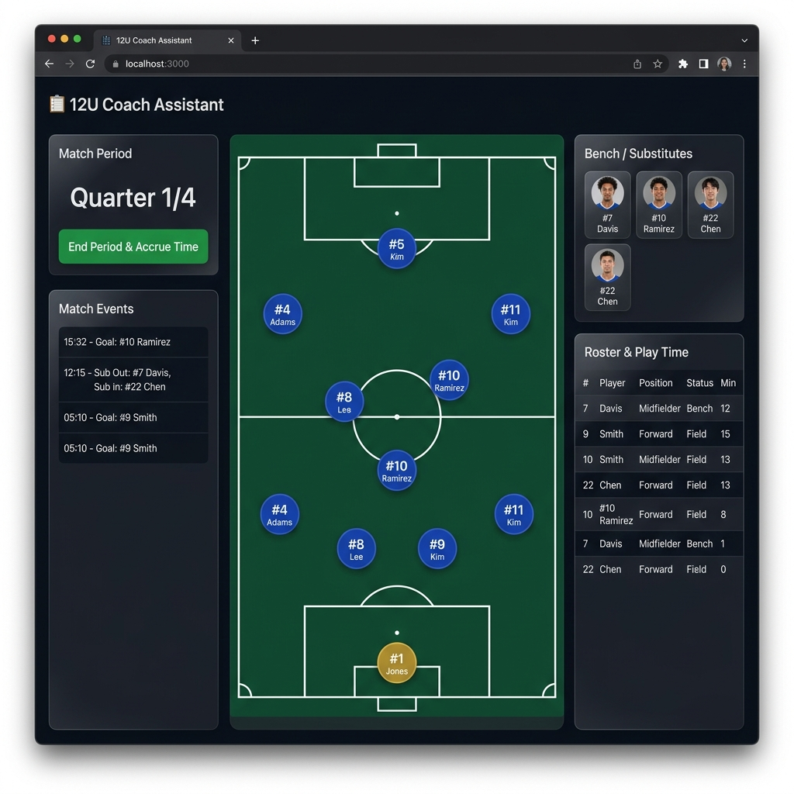
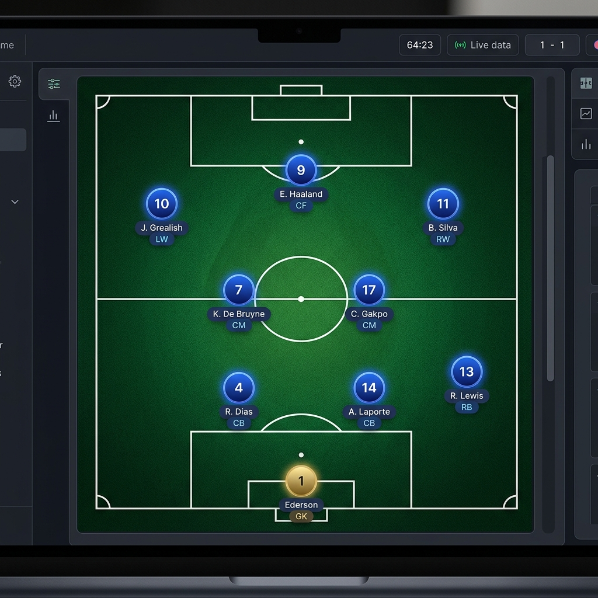
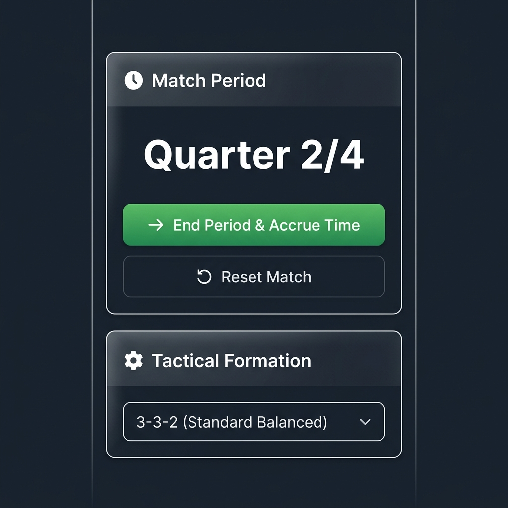
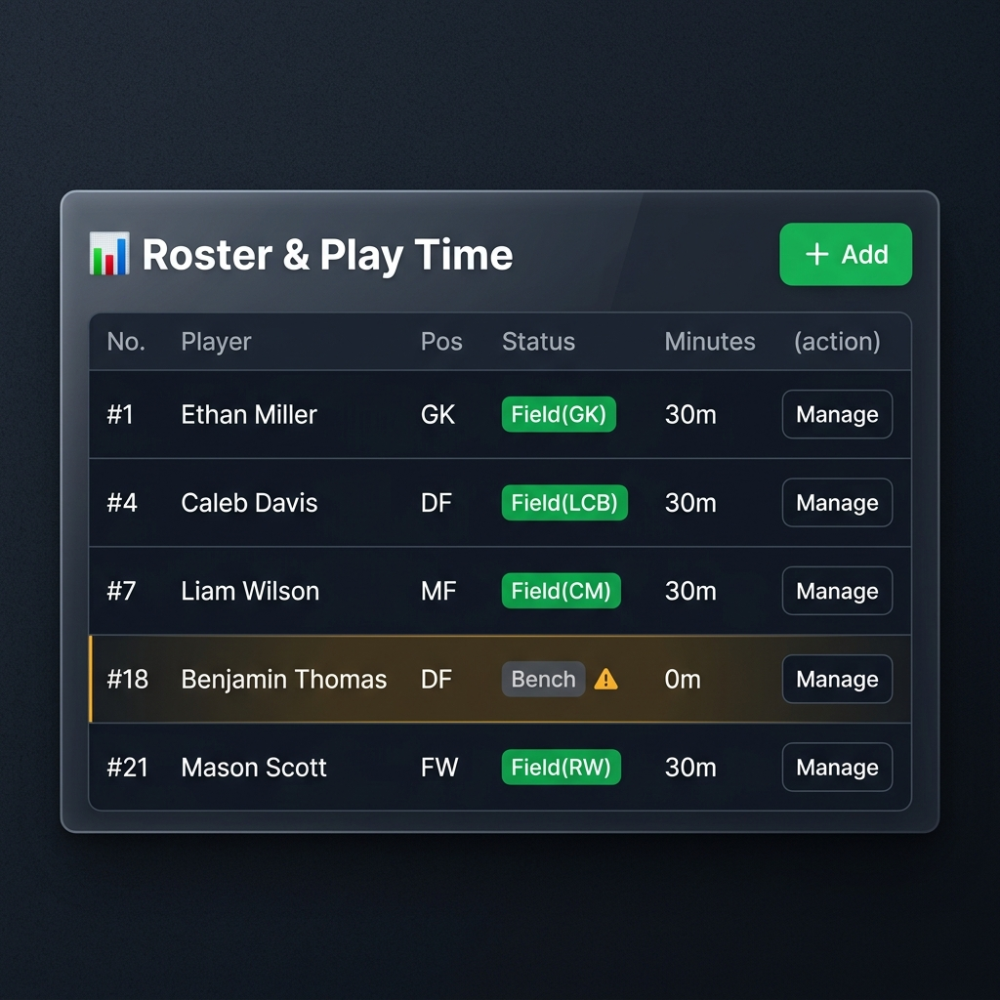

# ⚽ 12U Soccer Coach — Game Day Roster & Position Manager

A modern, touch-friendly web application for **12U (9v9) soccer coaches** to manage rosters, tactical formations, and equal playing time — all from a phone, tablet, or laptop on the sideline.

> Runs entirely in the browser with no backend or installation required. All data persists via `localStorage`.

---

## 📸 Screenshots

### Full App — Desktop View


### Tactical Pitch Close-up


### Match Period Tracker


### Equal Playing Time Table


---

## ✨ Features

### 🏟️ Tactical Pitch Visualizer
- SVG-rendered soccer field with full pitch markings — midfield line, center circle, penalty areas, goal areas, corner arcs, and goalposts
- Player icons are placed directly on the field at accurate tactical positions
- Players show their jersey number, name, preferred position, and minutes accrued
- Goalkeeper badge styled in gold; outfield players in blue
- Scales responsively for desktop, iPad, and mobile

### 👆 Touch-Friendly Drag & Drop
- Drag players from the **bench** directly onto a field position
- **Swap** two players on the field by dragging one onto the other's slot
- **Bench** a player instantly via the ✕ button on their badge
- Built with Pointer Events — works on mouse, touch, and stylus devices

### 📋 Roster Management
- Pre-loaded with a 12-player demo roster, ready to use immediately
- Add, edit, and remove players with name, jersey number, and preferred position
- All roster data saved in browser `localStorage` — persists across page reloads
- **Export** roster to JSON backup and **Import** from file

### ⏱ Match Period Tracker
- Replaces a live game clock — designed for sideline use without distractions
- Displays the current period clearly: **Quarter 1/4**, **Quarter 2/4**, etc.
- Supports **Quarters** (4 periods, default 15 min each — standard 12U) or **Halves** (2 periods)
- Click **"End Period & Accrue Time"** at whistle to credit the full period's minutes to all active field players automatically
- Button disables and shows 🏁 **Match Finished** after the final period
- Configurable period format and length via **Period Config** in Admin Settings

### 📊 Equal Playing Time Monitor
- Live play time table sorted by **least time played** — always shows who needs a sub first
- Players falling below the **50% benchmark** are flagged with an amber ⚠ **Sub In** warning tag
- Status column shows the player's current field position label (e.g., CM, LW) or "Bench"

### 📝 Match Event Log
- Automatically logs every substitution, formation change, period end, and roster action
- Tagged with the current period label (Q1, Q2, H1, etc.) and wall-clock time

### 🔄 Tactical Formations (9v9)
| Formation | Description |
|-----------|-------------|
| **3-3-2** | Standard Balanced |
| **3-2-3** | Attacking Wings |
| **4-3-1** | Defensive & Solid |
| **2-4-2** | Midfield Domination |

When switching formations, any player whose position no longer exists in the new scheme is **automatically moved to the bench** and logged as an OUT event.

---

## 🚀 Getting Started

No build tools or npm required. Just serve the files from a local server:

```bash
# Clone the repo
git clone https://github.com/LaGuardia/U12_Soccerapp.git
cd U12_Soccerapp

# Option 1: Python 3 (if installed)
python -m http.server 8080

# Option 2: VS Code — install "Live Server" extension and click "Go Live"

# Option 3: Any static file server will work
```

Then open **http://localhost:8080** in your browser.

> **Note:** The app uses ES6 `import/export` modules, so it must be served from a local HTTP server. Opening `index.html` directly as a `file://` URL will not load the JS modules.

---

## 📖 How to Use on Game Day

1. **Before the game** — Review and adjust your roster. Drag players from the bench to field positions in your starting formation.
2. **During the game** — Drag players to make substitutions. The event log records every move automatically.
3. **End of each period** — Click **"End Period & Accrue Time"**. Playing minutes are credited to every player currently on the field.
4. **Check the table** — Sort by play time to see who needs minutes. Players with a ⚠ tag are under the 50% threshold.
5. **After the match** — Use "Backup Roster" to export your roster JSON for next time.

---

## 🗂 Project Structure

```
U12_Soccerapp/
├── index.html              # Main layout — pitch, sidebars, modals
├── README.md               # This file
├── docs/                   # Screenshots and documentation images
├── css/
│   └── style.css           # Full design system (dark theme, glassmorphism, animations)
└── js/
    ├── app.js              # Central orchestrator — wires all modules together
    ├── formations.js       # 9v9 tactical formation coordinate definitions
    ├── roster.js           # Player CRUD, localStorage persistence, position sync
    ├── timer.js            # Match period tracker & playtime accrual engine
    ├── dragdrop.js         # Custom Pointer Event drag-and-drop controller
    └── pitch.js            # SVG pitch rendering & player badge creation
```

---

## 🎨 Design

Built with a premium **slate & emerald** dark theme:
- Glassmorphic sidebar panels with `backdrop-filter` blur
- Emerald green soccer pitch with white SVG field markings
- Blue jersey badges for outfield players, gold for the goalkeeper
- Smooth CSS animations for player badge spawning and drag interactions
- Google Fonts: **Outfit** (display) + **Inter** (body)
- Fully responsive — 3-column desktop, 2-column tablet, single-column mobile

---

## 🛠 Tech Stack

| Layer | Technology |
|-------|-----------|
| Structure | HTML5 (semantic, accessible) |
| Styling | Vanilla CSS (custom properties, grid, flexbox) |
| Logic | Vanilla JavaScript (ES6 modules) |
| Persistence | Browser `localStorage` |
| Graphics | Inline SVG |
| Input | Pointer Events API (mouse + touch + stylus) |

---

## 📄 License

MIT — free to use, modify, and distribute.
